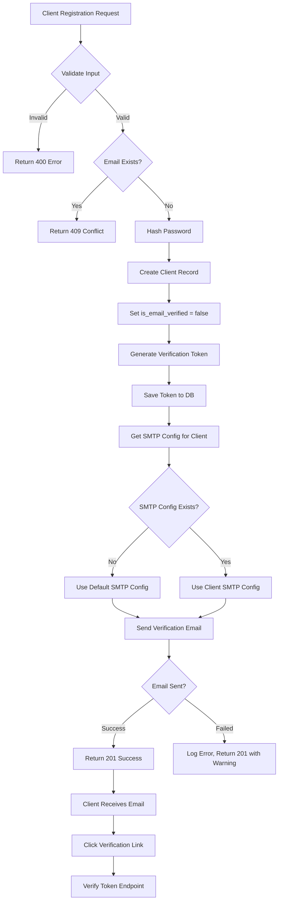
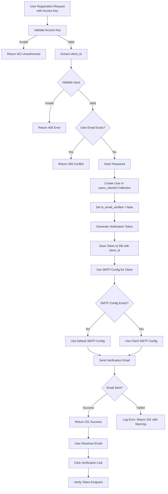
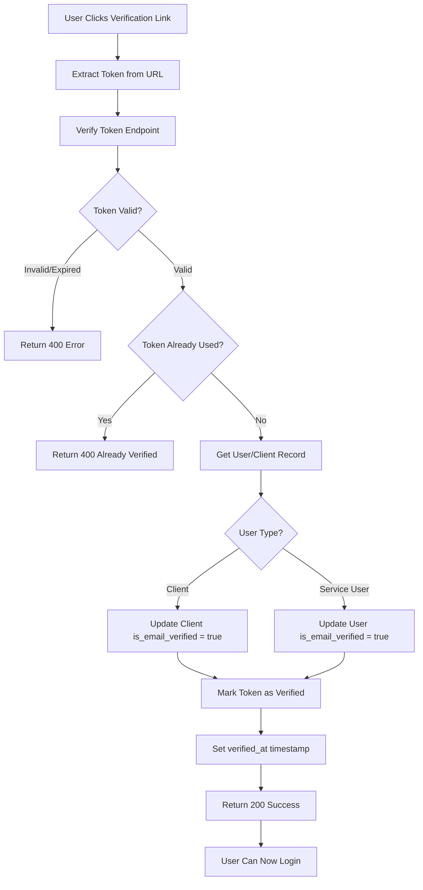
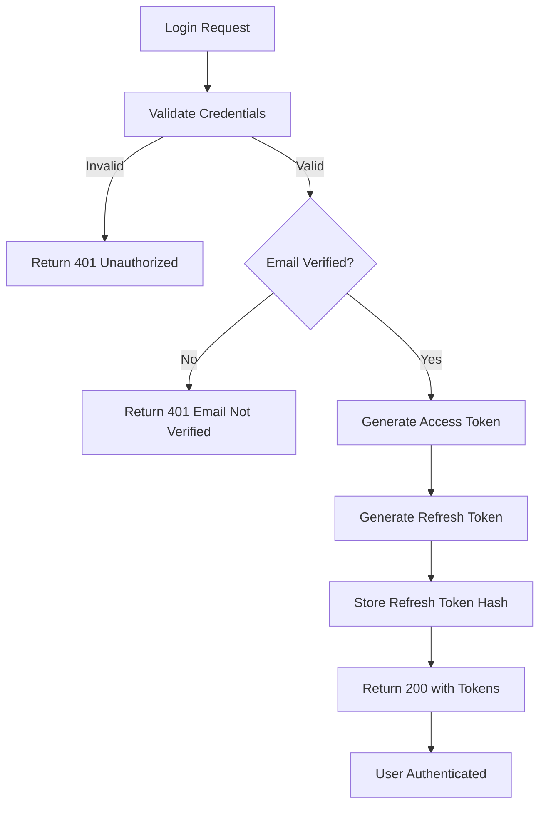
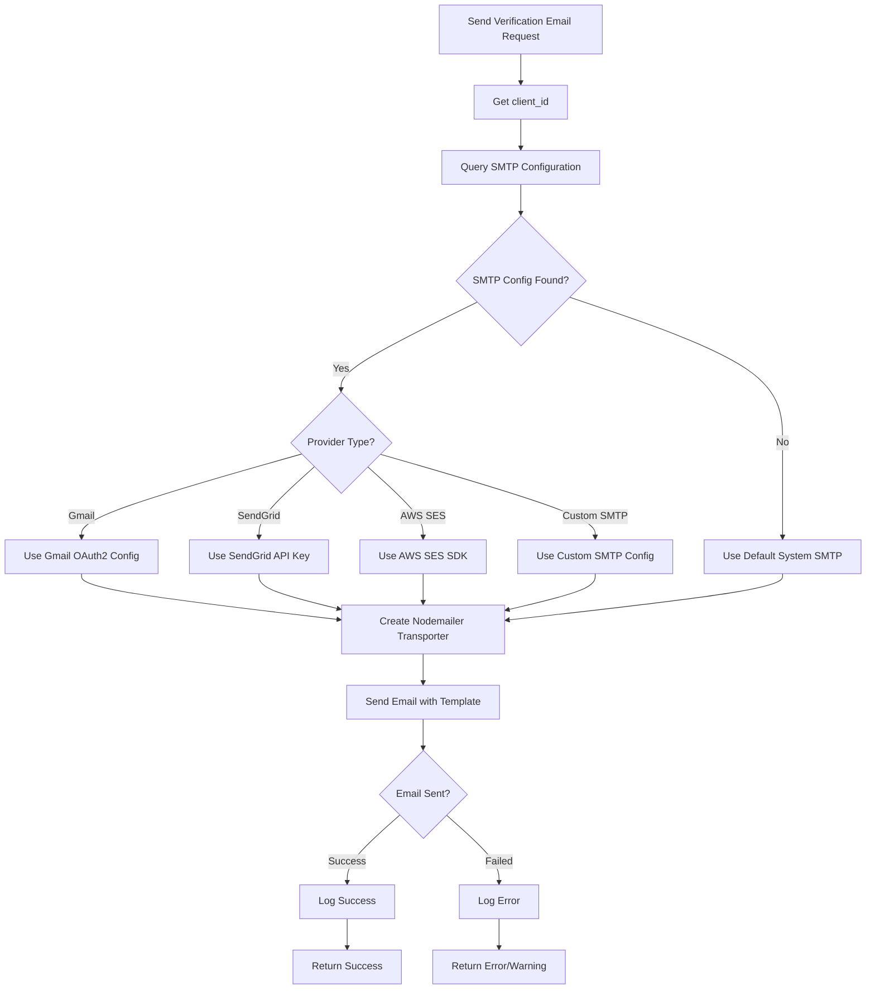
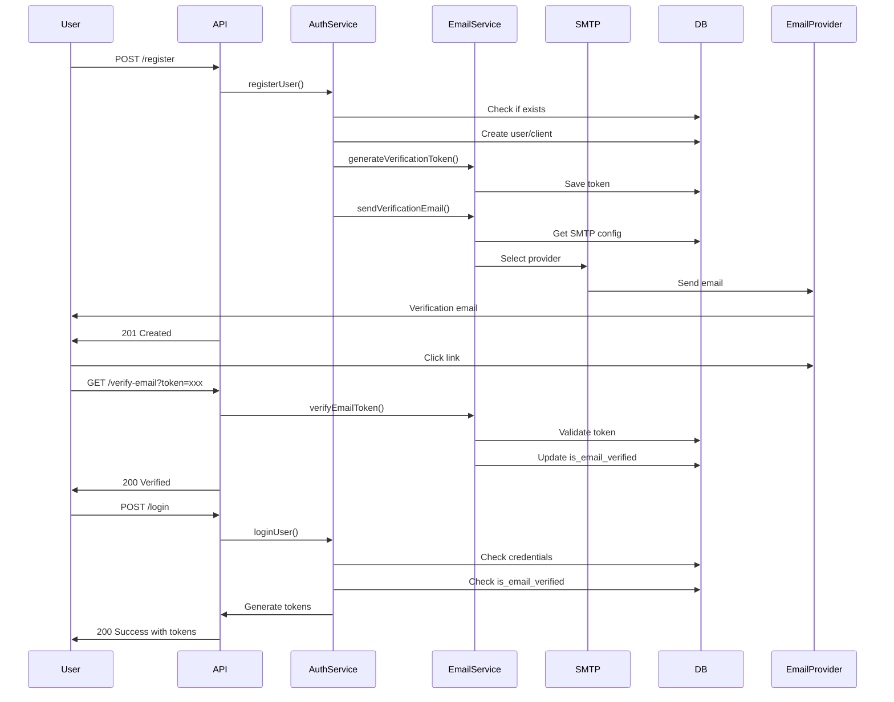
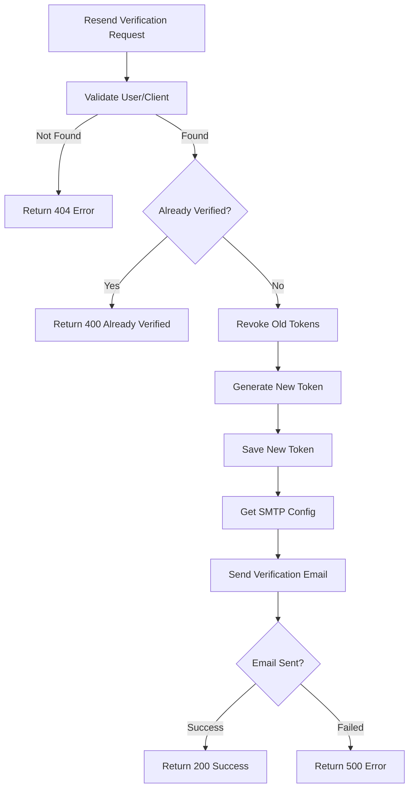

# Email Verification System - Flowchart

## Overview
This document describes the complete flow of email verification for both Client Auth and User Auth systems.

---

## 1. Client Registration with Email Verification Flow



---

## 2. Service User Registration with Email Verification Flow



---

## 3. Email Verification Process Flow



---

## 4. Login Flow with Email Verification Check



---

## 5. SMTP Provider Selection Flow



---

## 6. Complete Registration to Verification Flow



---

## 7. Resend Verification Email Flow



---

## Key Components

### Database Collections
- **email_verification_tokens**: Stores verification tokens
- **smtp_configurations**: Stores SMTP settings per client
- **clients**: Updated with `is_email_verified` field
- **users_<clientId>**: Updated with `is_email_verified` field

### Services
- **emailVerificationService**: Handles token generation and verification
- **emailService**: Handles email sending via multiple providers
- **authService**: Updated to send verification emails
- **userService**: Updated to send verification emails

### Endpoints
- `POST /api/v1/client/auth/verify-email` - Verify client email
- `POST /api/v1/client/auth/resend-verification` - Resend client verification
- `POST /api/v1/service/auth/verify-email` - Verify user email
- `POST /api/v1/service/auth/resend-verification` - Resend user verification

---

## Security Considerations

1. **Token Expiry**: Verification tokens expire after 24 hours
2. **One-Time Use**: Tokens are marked as used after verification
3. **Rate Limiting**: Resend verification limited to 3 requests per hour
4. **Token Hashing**: Tokens are hashed before storage
5. **SMTP Credentials**: Encrypted in database
6. **Email Validation**: Email format validated before sending
```

Should I save this as a file, or would you prefer a different format? The Mermaid diagrams render in most markdown viewers (GitHub, GitLab, VS Code with extensions, etc.).
